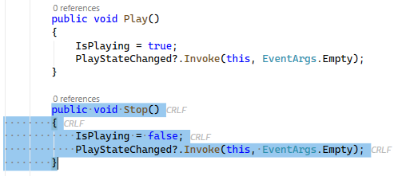
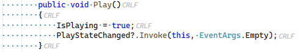

[marketplace]: https://marketplace.visualstudio.com/items?itemName=MadsKristensen.SelectedWhitespace
[repo]: https://github.com/madskristensen/SelectedWhitespace

# Selected Whitespace

Download this extension from the [Visual Studio Marketplace][marketplace].

--------------------------------------

**See whitespace characters only when you need them.** This extension displays whitespace characters (spaces, tabs, and line endings) only within selected text, keeping your editor clean and clutter-free.

## Features

### Selection-Based Whitespace

Select any text to instantly reveal its whitespace characters:

| Character | Symbol | Description |
|-----------|--------|-------------|
| Space | `·` | Middle dot |
| Tab | `→` | Rightwards arrow |
| CRLF | `\r\n` | Windows line ending |
| LF | `\n` | Unix/macOS line ending |
| CR | `\r` | Classic Mac line ending |

Line endings include tooltips explaining their type (e.g., "CRLF (Windows)").

### Extended View White Space Mode

When Visual Studio's built-in **View White Space** setting is enabled (Edit → Advanced → View White Space, or `Ctrl+R, Ctrl+W`), this extension enhances it by also displaying line endings throughout the document. VS normally only shows spaces and tabs.

### Smart Behavior

- **No duplication** - Selection whitespace is automatically disabled when View White Space is on
- **Outlining aware** - Whitespace inside collapsed code regions is hidden
- **Non-intrusive** - Uses subtle gray coloring that doesn't distract from your code

## How It Works

1. Select any text in the editor
2. Whitespace characters appear automatically within the selection
3. Clear the selection and they disappear

No commands, no configuration - it just works!

## Requirements

- Visual Studio 2022 (17.0 or later)

## How can I help?

Give it a rating on the [Visual Studio Marketplace][marketplace] or report issues on [GitHub][repo].
