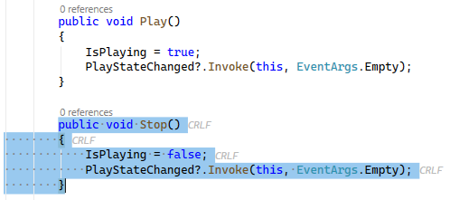
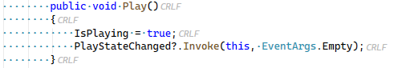

# Whitespace Visualizer

See whitespace characters only when you need them. This extension displays whitespace characters (spaces, tabs, and line endings) only within selected text, keeping your editor clean and clutter-free.

Download this extension from the [Marketplace](https://marketplace.visualstudio.com/items?itemName=MadsKristensen.SelectedWhitespace)
or get the [CI build](http://vsixgallery.com/extension/SelectedWhitespace.63944e24-4aa2-4d0a-8161-4b7eb9f39831/).

> Inspired by a community Visual Studio [feature request](https://developercommunity.visualstudio.com/t/Option-to-only-display-whitespace-charac/1516269). Go vote for it!

## Selection-based whitespace

Select any text to instantly reveal its whitespace characters:

| Character | Symbol   | Description             |
| --------- | -------- | ----------------------- |
| Space     | `·`      | Middle dot              |
| Tab       | `→`      | Rightwards arrow        |
| CRLF      | *`CRLF`* | Windows line ending     |
| LF        | *`LF`*   | Unix/macOS line ending  |
| CR        | *`CR`*   | Classic Mac line ending |

Line endings include tooltips explaining their type (e.g., "CRLF (Windows)").

## Extended View White Space mode

When Visual Studio's built-in **View White Space** setting is enabled (`Edit → Advanced → View White Space`, or `Ctrl+R, Ctrl+W`), this extension enhances it by also displaying line endings throughout the document. VS normally only shows spaces and tabs.

## Smart behavior

- **No duplication** — Selection whitespace is automatically disabled when View White Space is on
- **Outlining aware** — Whitespace inside collapsed code regions is hidden
- **Non-intrusive** — Uses subtle gray coloring that doesn't distract from your code
- **Run-aware** — Can show only whitespace runs with 2+ consecutive spaces/tabs
- **Context-aware** — Can filter runs by indentation, inline, and trailing whitespace contexts
- **Configurable symbols** — Customize symbols for spaces, tabs, and line endings

## Options

Configure behavior under **Tools → Options → Whitespace Visualizer → General**.

The defaults are tuned to reduce noise

## How it works

1. Select any text in the editor
2. Whitespace characters appear automatically within the selection
3. Clear the selection and they disappear

No commands required — it works out of the box.

## License
[Apache 2.0](LICENSE)
